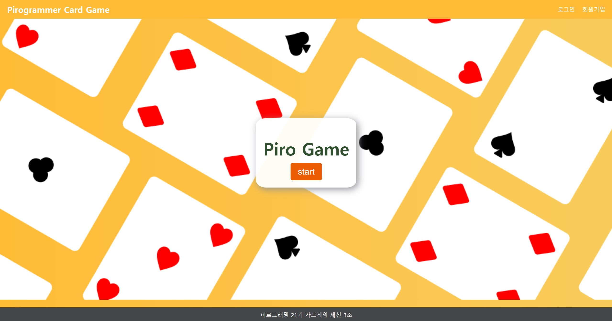

# Piro21_CardGame_03
   

* ### 협업툴 링크
> 💙[Notion](https://www.notion.so/3202ac4605684639819aa19f3a70eb2d?v=1bc40a988c0c452e9e02cb6c81b759ff&pvs=4)  
  > [작업 페이지](https://roomy-may-da8.notion.site/3202ac4605684639819aa19f3a70eb2d?v=1bc40a988c0c452e9e02cb6c81b759ff&pvs=4)  
  > [회의 페이지](https://roomy-may-da8.notion.site/d68df61836fe42df8c661e2357ae35fa?v=c81601fe7c264279b6b7e063b3e885d2&pvs=4)  
  > [프로젝트 페이지](https://roomy-may-da8.notion.site/d9ea7a4433614422a02e295dd27b14cf?v=179b7d0605b443eeacdb814b6c9e0d9f&pvs=4) 
> 💙[Figma](https://www.figma.com/design/lVoYGKobfu8DnyAfgWBMQS/Piro03_CardGame?node-id=0-1&t=h4xHCriz9EKDDxZo-0)  
 
> 💙[ERD](https://www.erdcloud.com/d/DTuhvqJYsM3Ff5ZxQ)  

 

#### 사용 전 주의사항
pip install django-allauth